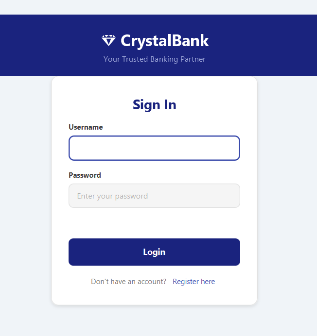
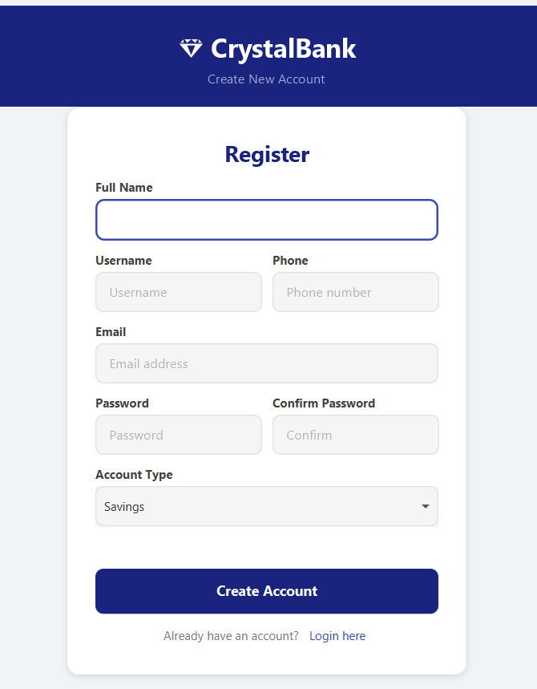
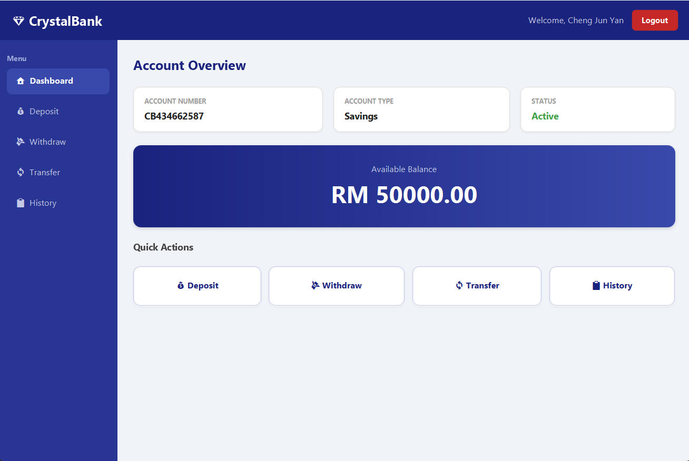
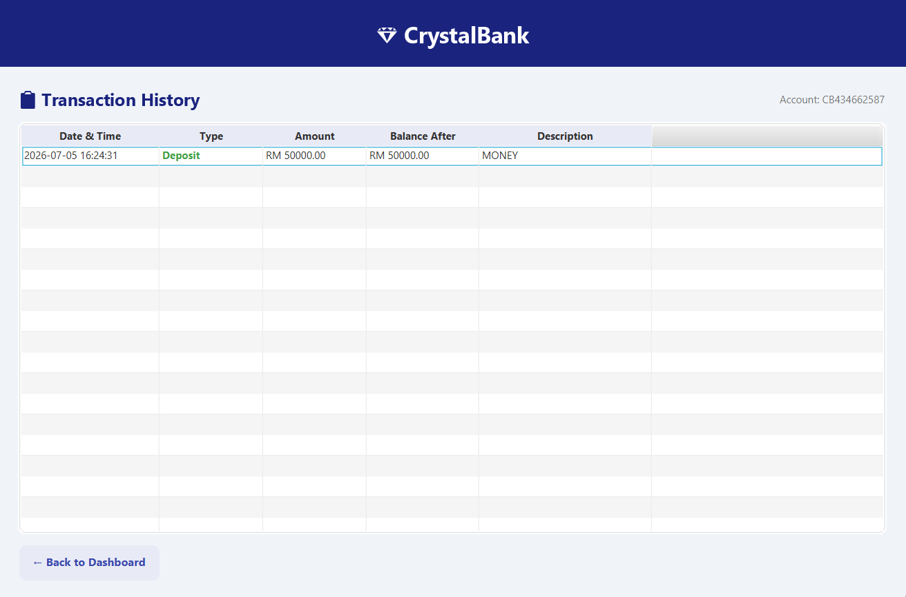
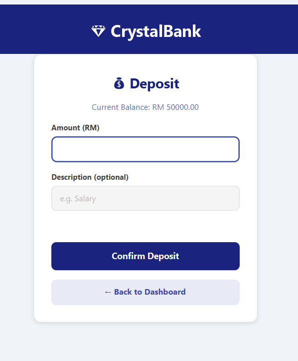
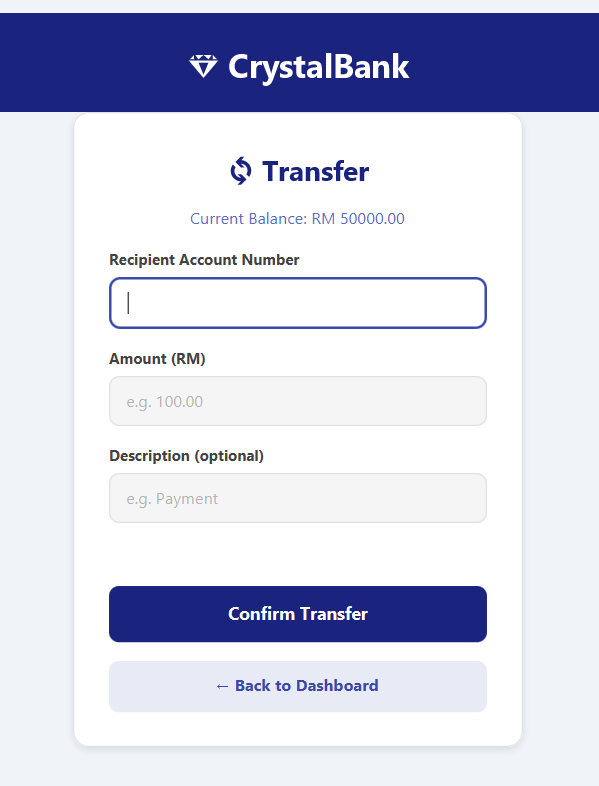
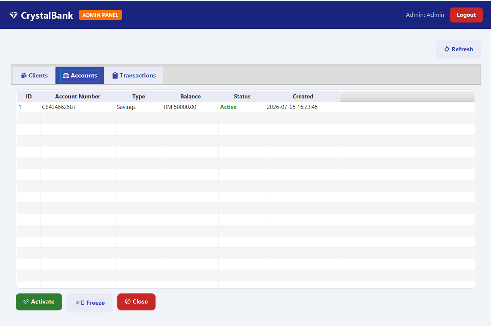

<div align="center">

# 💎 CrystalBank

**A desktop banking management system built with JavaFX and SQLite.**


</div>

---

## 📖 Table of Contents

- [Introduction](#-introduction)
- [Screenshots](#-screenshots)
- [Features](#-features)
- [Tech Stack](#-tech-stack)
- [Project Structure](#-project-structure)
- [Prerequisites](#-prerequisites)
- [Setup & Installation](#-setup--installation)
- [Default Login](#-default-login)
- [Database](#-database)

---

## 🌟 Introduction

**CrystalBank** is a desktop banking management system developed using **JavaFX** for the graphical user interface and **SQLite** as the local database. The system supports two roles — **Admin** and **Client** — each with their own dedicated interface. Clients can perform core banking operations such as deposit, withdrawal, and fund transfer, while admins can manage all accounts and monitor transactions across the system.

The application follows the **MVC (Model-View-Controller)** architecture pattern, separating UI (FXML), business logic (Controllers), data models (Model), and database operations (DatabaseManager).

---

## 📱 Screenshots

> 💡 **How to add your screenshots:**
> 1. Create a `screenshots/` folder in your repo root
> 2. Run the app and take screenshots of each screen
> 3. Save them with the filenames below — they will appear automatically

| Login | Register |
|:-----:|:--------:|
|  |  |

| Dashboard | Transaction History |
|:---------:|:-------------------:|
|  |  |

| Deposit | Transfer |
|:-------:|:--------:|
|  |  |

| Admin Panel — Accounts | Admin Panel — Transactions |
|:----------------------:|:--------------------------:|
|  |  |

---

## ✨ Features

### 👤 Client Features
- ✅ **Register** — Create a new account with full name, username, email, phone, and account type (Savings / Current)
- ✅ **Login** — Secure login with username and password
- ✅ **Dashboard** — View account number, account type, balance, and account status at a glance
- ✅ **Deposit** — Add funds to your account (max RM 50,000 per transaction)
- ✅ **Withdraw** — Withdraw funds with balance validation
- ✅ **Transfer** — Transfer funds to another CrystalBank account by account number
- ✅ **Transaction History** — View last 50 transactions with type, amount, balance after, and description

### 🔧 Admin Features
- ✅ **View All Clients** — See all registered client accounts
- ✅ **View All Accounts** — Monitor all bank accounts with balance and status
- ✅ **View All Transactions** — Full transaction log across all accounts
- ✅ **Freeze Account** — Temporarily freeze a client account
- ✅ **Activate Account** — Re-activate a frozen account
- ✅ **Close Account** — Permanently close an account

### 🎨 UI Features
- ✅ Clean blue and white banking theme
- ✅ Colour-coded transaction types (green for credit, red for debit)
- ✅ Colour-coded account status (green = Active, blue = Frozen, red = Closed)
- ✅ Responsive form validation with error messages
- ✅ Sidebar navigation on dashboard

---

## 🛠 Tech Stack

| Layer | Technology |
|-------|-----------|
| Language | Java 17 |
| UI Framework | JavaFX 21 |
| UI Layout | FXML + CSS |
| Database | SQLite (via sqlite-jdbc 3.45) |
| Build Tool | Maven |
| Architecture | MVC Pattern |
| IDE | IntelliJ IDEA / Eclipse |

---

## 📁 Project Structure

```
CrystalBank/
├── pom.xml                          ← Maven dependencies
└── src/main/
      ├── java/com/crystalbank/
      │     ├── MainApp.java                  ← App entry point
      │     ├── model/
      │     │     ├── User.java
      │     │     ├── Account.java
      │     │     └── Transaction.java
      │     ├── database/
      │     │     └── DatabaseManager.java    ← All SQLite operations
      │     ├── util/
      │     │     └── SessionManager.java     ← Stores logged-in user session
      │     └── controller/
      │           ├── LoginController.java
      │           ├── RegisterController.java
      │           ├── DashboardController.java
      │           ├── DepositController.java
      │           ├── WithdrawController.java
      │           ├── TransferController.java
      │           ├── TransactionHistoryController.java
      │           └── AdminController.java
      └── resources/com/crystalbank/
            ├── login.fxml
            ├── register.fxml
            ├── dashboard.fxml
            ├── deposit.fxml
            ├── withdraw.fxml
            ├── transfer.fxml
            ├── transactionHistory.fxml
            ├── admin.fxml
            └── styles.css                   ← All UI styling
```

---

## 📋 Prerequisites

Make sure you have the following installed:

- [JDK 17](https://www.oracle.com/java/technologies/downloads/#java17) or above
- [JavaFX SDK 21](https://gluonhq.com/products/javafx/) — download and unzip
- [IntelliJ IDEA](https://www.jetbrains.com/idea/download/) (Community Edition is free)
- [Maven](https://maven.apache.org/) — bundled with IntelliJ, no separate install needed

---

## 🚀 Setup & Installation

### Step 1 — Clone the Repository

```bash
git clone https://github.com/YOUR_USERNAME/CrystalBank.git
```

```bash
cd CrystalBank
```

### Step 2 — Open in IntelliJ IDEA

1. Open IntelliJ IDEA
2. Click **File → Open**
3. Select the `CrystalBank` folder
4. Click **OK** — IntelliJ will detect the `pom.xml` automatically

### Step 3 — Let Maven Download Dependencies

IntelliJ will automatically download all dependencies from `pom.xml`. Wait for the progress bar at the bottom to finish.

If it doesn't start automatically:

```bash
mvn clean install
```

### Step 4 — Configure JavaFX SDK

1. Go to **File → Project Structure → Libraries**
2. Click **+** → **Java**
3. Browse to your JavaFX SDK `lib` folder, for example:
   ```
   C:\javafx-sdk-21\lib
   ```
4. Click **OK** → **Apply** → **OK**

### Step 5 — Run the Application

Open `MainApp.java` → click the **Run** button (▶️) or press `Shift + F10`

The login screen will appear automatically. The SQLite database `crystalbank.db` is created automatically on first run.

---

## 🔑 Default Login

### Admin Account
| Field | Value |
|-------|-------|
| Username | `admin` |
| Password | `admin123` |

### Client Account
Register a new account from the login screen by clicking **"Register here"**.

---

## 🗄️ Database

The app uses **SQLite** — no server setup required. The database file is automatically created at:

```
CrystalBank/crystalbank.db
```

### Tables

| Table | Description |
|-------|-------------|
| `users` | Stores all user accounts (Admin + Client) |
| `accounts` | Stores bank accounts linked to users |
| `transactions` | Stores all deposit, withdraw, and transfer records |

> 💡 You can view the database contents using [DB Browser for SQLite](https://sqlitebrowser.org/) — a free tool that lets you inspect the tables directly.

---

<div align="center">

Made with using JavaFX

</div>
